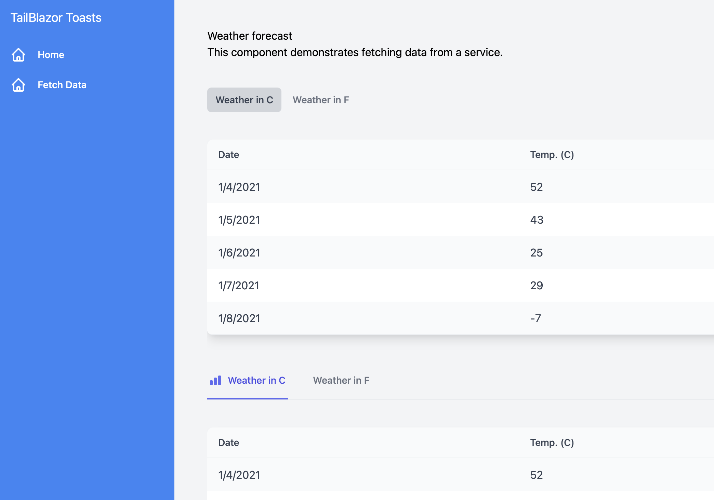

# TailBlazor.Tabs

Blazor tabs using Tailwindcss v2.0+

A base component capable of full customization, including the addition of icons or full control over the tab title and layout. Without passing it anything you'll get very basic styles, however giving it it's base classes and you can do whatever Tailwind is capable of.




## Getting Setup

You can install the package via the NuGet package manager just search for TailBlazor.Tabs. You can also install via powershell using the following command.

`Install-Package TailBlazor.Tabs`

Or via the dotnet CLI.

`dotnet add package TailBlazor.Tabs`

### 1. Add Imports

Add line to your \_Imports.razor

```
@using TailBlazor.Tabs
```

### 2. Create Tabs Component

Inside your page create your tabs component with the basic format below. For tabs styles, use the `Class` parameter. Anything inside the `TailBlazorTab` automatically maps to the ChildContext and is displayed at the content for the tab. Using the parameter `title` inside the tab let's you name the tab.

```
<TailBlazorTabs Class="py-10">
    <TailBlazorTab title="Tab 1 Title">
        ...
    </TailBlazorTab>
    <TailBlazorTab title="Tab 2 Title">
        ...
    </TailBlazorTab>
</TailBlazorTabs>
```

### 3. Using TitleContent and TabContent instead of ChildContent

Using ChildContext is great for about 95% of Tab use cases. However sometimes you want full control over the html inside the button. This is where `TitleContent` comes in.

Instead of using the title parameter, use the `TitleContent` RenderFragment to allow things like stylized text, or icons.

```
...
<TailBlazorTab>
    <TitleContent>
        <TailBlazorHeroIcon Icon=HeroIcon.Beaker Stroke="text-indigo-500" />
        <span>Weather in C</span>
    </TitleContent>
    <TabContent>
        ...
    </TabContent>
</TailBlazorTab>
...
```

Keep in mind if you use the `TitleContent`, you must then also use the `TabContent` in place of the default ChildContent render fragment.

### 4. Additional Styles

On top of being able to use `TitleContent`, you can also specify `ActiveClass` and default `Class` to show which tab is active and not. When the tab is active, the `Class` parameter is completely replaced by the `ActiveClass` you giving you more control over just adding styles.

```
<TailBlazorTabs class="my-10 border-b border-grey-600 flex space-x-8">
    <TailBlazorTab 
        ActiveClass="border-indigo-500 text-indigo-600 group inline-flex items-center py-4 px-1 border-b-2 font-medium text-sm" 
        Class="border-transparent text-gray-500 hover:text-gray-700 hover:border-gray-300 group inline-flex items-center py-4 px-1 border-b-2 font-medium text-sm">
    ...
...
```

### 5. Using EventCallbacks

You can get the onclick event for individual tabs or throw a single callback on the parent to get back the click event of whatever the active tab is

Example of using the callback on the Tabs parent
```
<TailBlazor.Tabs.TailBlazorTabs OnClickCallback=OnParentClickEvent>
    <TailBlazor.Tabs.TailBlazorTab Title="Counter Tab">
        <p>Counter: @(counter)</p>
    </TailBlazor.Tabs.TailBlazorTab>
    <TailBlazor.Tabs.TailBlazorTab>
        <TitleContent>
            Another Tab
        </TitleContent>
        <TabContent>
            ...
        </TabContent>
    </TailBlazor.Tabs.TailBlazorTab>
</TailBlazor.Tabs.TailBlazorTabs>

@code {
    public string Test { get; set; } = "first";

    int counter = 1;

    void OnParentClickEvent(ITab tab)
    {
        Console.WriteLine($"Tab: {tab.Title} was clicked.");
        counter++;
    }
}
```


Example of using the callback on a specific Tab
```
@page "/Tabs"
@using TailBlazor.Tabs

<TailBlazor.Tabs.TailBlazorTabs>
    <TailBlazor.Tabs.TailBlazorTab OnClickCallback=OnClickEvent Title="Test">
        <p>@(Test)</p>
    </TailBlazor.Tabs.TailBlazorTab>
    <TailBlazor.Tabs.TailBlazorTab>
        <TitleContent>
            Second Tab
        </TitleContent>
        <TabContent>
            ...
        </TabContent>
    </TailBlazor.Tabs.TailBlazorTab>
</TailBlazor.Tabs.TailBlazorTabs>

@code {
    int counter = 1;

    void OnClickEvent(ITab tab)
    {
        Test = tab.Title + counter;
        counter++;
    }
}
```

### 6. Setting Active Tab

Sometimes you may want to set the active tab on intialization or even switch based off user interaction. The tabs are automatically numbered 0-X based of position from left to right. For example if you had three tabs they would have the Id of 0, 1, 2.

Setting the tab can be done as follows


```
<TailBlazor.Tabs.TailBlazorTabs @bind-SelectedTab=activeTab>
    <TailBlazor.Tabs.TailBlazorTab Class="border-transparent text-gray-500 hover:text-gray-700>
    ...

...

<button @onclick=SwitchTab class="py-3 px-6 bg-blue-400 text-white">
    Switch Tab
</button>

@code {
    int activeTab = 1;

    void SwitchTab()
    {
        activeTab = 0;
    }
}
```